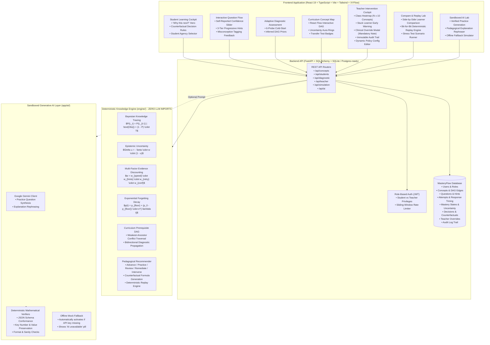

# MasteryFlow 🧠⚡
> **An Explainable Adaptive Learning and Teacher Intervention Engine**  
> *Built for Hackathon Problem Statement: Intelligent Educational Systems (Theme: Transforming Education through Generative AI)*

[](file:///tests)
[](file:///frontend/e2e/checkpoint8_flows.spec.ts)
[](file:///engine)
[](file:///LICENSE)

---

## 1. Problem Statement & Challenge

Most current "AI in Education" applications treat Large Language Models as autonomous tutors that assess student ability and decide what a child should learn next. In high-stakes educational environments, this black-box approach introduces catastrophic failure modes:
1. **Hallucinatory Mastery**: LLMs cannot reliably compute mathematical probability distributions over knowledge components, frequently declaring students "mastered" after superficial responses.
2. **Ungrounded Decisions**: When a student is assigned remedial tasks, neither student nor teacher is provided with a mathematical explanation or counterfactual justification.
3. **Undetected Student Exploits**: Students exploit standard LLM tutors through rapid guessing, retry spamming, or asking for progressive hints, which falsely inflates perceived competence.
4. **Lack of Human Agency**: Teachers are locked out of the algorithmic decision loop, unable to inspect why a student is stuck or apply clinical pedagogic overrides with accountability.

### The MasteryFlow Solution
MasteryFlow decouples pedagogical intelligence into a **two-tier architecture**:
- **Core Engine (100% Deterministic Python)**: A Bayesian Knowledge Tracing (BKT) engine with dual-state mastery $p_{\text{mastery}}$ and epistemic uncertainty $u$, time-decay forgetting, prerequisite directed acyclic graphs (DAGs), multi-factor evidence weighting, and counterfactual explainability. It contains **zero LLM imports** and guarantees 100% mathematical reproducibility.
- **Generative AI Layer (Strictly Sandboxed)**: An optional LLM component (powered by Google Gemini) strictly restricted to generating fresh practice items and rephrasing explanations. Output is deterministically verified before reaching the learner. If the LLM is absent or fails, the application continues to run with zero degradation.

---

## 2. Architecture Diagram



---

## 3. Algorithm in Plain Language with Formulas

### A. Dual-State Knowledge Tracing: Mastery ($p$) and Uncertainty ($u$)
Standard Bayesian Knowledge Tracing (BKT) assumes a static certainty. MasteryFlow models student competence as a tuple: $(p_{\text{mastery}}, u)$, where $p \in [0, 1]$ represents the probability of concept mastery and $u \in [0, 1]$ represents the epistemic uncertainty (the system's lack of confidence in the estimate).

Given observation $Y_t \in \{0, 1\}$ (incorrect / correct), item slip $s$, item guess $g$, and transition probability $T$:

$$P(L_t | Y_t = 1) = \frac{P(L_{t-1}) \cdot (1 - s)}{P(L_{t-1}) \cdot (1 - s) + (1 - P(L_{t-1})) \cdot g}$$

$$P(L_t | Y_t = 0) = \frac{P(L_{t-1}) \cdot s}{P(L_{t-1}) \cdot s + (1 - P(L_{t-1})) \cdot (1 - g)}$$

$$P(L_t) = P(L_t | Y_t) + (1 - P(L_t | Y_t)) \cdot T$$

Epistemic uncertainty decreases with weighted evidence $w$:
$$u_t = \max\left(u_{min}, u_{t-1} - 0.15 \cdot w \cdot (1 - u_{min})\right)$$

### B. Multi-Factor Evidence Weighting ($w \in [0, 1]$)
Not all correct answers represent mastery. MasteryFlow dynamically scales the Bayesian update magnitude using an evidence weight $w$:

$$w = w_{\text{speed}} \cdot w_{\text{hints}} \cdot w_{\text{retry}} \cdot w_{\text{confidence}}$$

1. **Rapid Guess Discount ($w_{\text{speed}}$)**: If response time $< 3000\text{ ms}$, $w_{\text{speed}} = 0.20$. If $< 1200\text{ ms}$, $w_{\text{speed}} = 0.10$.
2. **Progressive Hint Deductions ($w_{\text{hints}}$)**:
   - 0 hints used: $w_{\text{hints}} = 1.00$
   - 1 hint used (conceptual reminder): $w_{\text{hints}} = 0.70$
   - 2 hints used (formula assistance): $w_{\text{hints}} = 0.45$
   - 3 hints used (worked example revealed): $w_{\text{hints}} = 0.15$
3. **Rapid Retry Deduplication ($w_{\text{retry}}$)**: Duplicate attempts submitted within $60\text{ seconds}$ receive $w_{\text{retry}} = 0.0$ ($\Delta p = 0.0$), eliminating spamming attacks.
4. **Lucky Guess Attenuation ($w_{\text{confidence}}$)**: If a student self-reports confidence level 1 ("Pure Guess") yet answers correctly, $w_{\text{confidence}} = 0.60$.

### C. Difficulty Ceiling & Transfer Requirement
- Questions are categorized into three cognitive tiers: `recall`, `procedural`, and `transfer`, with difficulty ratings $d \in \{1, 2, 3, 4, 5\}$.
- **Difficulty Ceiling**: Practicing only difficulty 1–2 items caps maximum mastery at $0.70$.
- **Strict Transfer Requirement**: A concept **cannot** enter the `mastered` state ($p \ge 0.85$) until the student passes at least one difficulty 4 or 5 `transfer` item unprompted.

### D. Exponential Forgetting Decay
Knowledge degrades exponentially with inactivity:

$$p(t) = p_{\text{floor}} + (p_0 - p_{\text{floor}}) \cdot e^{-\lambda t}$$

Where $p_{\text{floor}} = 0.20$, half-life $t_{1/2} = 14\text{ days}$ ($\lambda = \frac{\ln 2}{14 \times 86400}$), and $t$ is seconds elapsed since last verified practice.
- **Forgetting Failure Mode**: If an attempt fails after $> 7\text{ days}$ of inactivity, the engine classifies the error as `forgetting` and schedules **Spaced Review**, NOT remedial prerequisite regression.

### E. Prerequisite DAG Weakest-Ancestor Traversal
The curriculum is organized as a directed acyclic graph (10 interconnected concepts from Fractions to Percentage Change). Before a learner can `Advance` to concept $C$:
- The engine computes satisfaction across all ancestor nodes: $\forall A \in \text{Ancestors}(C), p(A) \ge 0.65$.
- If unsatisfied, the engine identifies the **weakest ancestor node** ($A^* = \arg\min p(A)$) and diverts the student backwards with a numeric explanation:
  `"Remediate Prerequisite before unit_rates: ancestor 'fraction_basics' mastery is 42% (±55%), below required threshold of 65%. Diverting to weakest dependency."`

### F. Counterfactual Explainability
Every recommendation is paired with an actionable counterfactual condition answering: *"What would change this recommendation?"*
$$\text{If } \Delta \text{Evidence} \ge \text{Threshold} \implies \text{Next Action moves from } A_1 \to A_2$$

---

## 4. AI vs. Own-Logic Architectural Split

| System Responsibility | Component | Mechanism | LLM Involvement |
| :--- | :--- | :--- | :--- |
| **Mastery Calculation** | `engine/bayesian.py` | Exact Bayesian inference + uncertainty | **Zero (0%)** |
| **Evidence Weighting** | `engine/bayesian.py` | Millisecond timing, hint penalty, confidence | **Zero (0%)** |
| **Retention Decay** | `engine/forgetting.py` | Continuous exponential decay formula | **Zero (0%)** |
| **Prerequisite Resolution** | `engine/graph.py` | Topological graph traversal | **Zero (0%)** |
| **Action Recommendations** | `engine/recommender.py` | Deterministic policy evaluation | **Zero (0%)** |
| **Teacher Interventions** | `engine/recommender.py` | Consecutive failure & oscillation detection | **Zero (0%)** |
| **Audit Log Integrity** | `app/models.py` | Immutable SQLite/Postgres append-only log | **Zero (0%)** |
| **Deterministic Replay** | `engine/recommender.py` | Re-executes raw attempt log bit-for-bit | **Zero (0%)** |
| **Practice Question Generation** | `app/ai/client.py` | Gemini 2.5 Flash + Deterministic Validator | Optional (Sandboxed) |
| **Explanation Rephrasing** | `app/ai/client.py` | Gemini 2.5 Flash + Numerical Preserver | Optional (Sandboxed) |

> [!IMPORTANT]
> **Hard Rule Guarantee**: The LLM is never allowed to set mastery levels, adjust uncertainty, or select pedagogical actions. If Gemini is unavailable, misconfigured, or returns invalid math, the sandbox rejects the output and MasteryFlow operates 100% autonomously using its curated pedagogical database.

---

## 5. Limitations

1. **Curriculum Scope**: The initial deployment covers 10 middle-school mathematics concepts (`fraction_basics` through `percentage_change`). While extensible via `engine/graph.py`, broader subject areas (calculus, physics) require authoring prerequisite edges.
2. **Prior Slip and Guess Estimation**: In this version, item slip $s$ and guess $g$ are calculated deterministically as a function of item difficulty and item type ($g \in [0.05, 0.25]$, $s \in [0.04, 0.15]$). In enterprise production, these can be calibrated via Item Response Theory (IRT) across hundreds of thousands of student attempts.
3. **Single Active Teacher Session**: While multi-tenant role-based JWT authentication is fully implemented, classroom assignment grouping is currently flat (one cohort).

---

## 6. Known Failure Cases & Mitigations

| Failure Mode | Manifestation | Engine Mitigation |
| :--- | :--- | :--- |
| **Fast Guessing / Trial & Error** | Student rapidly clicks answers in $<1.5\text{s}$ | `w_speed` reduces update weight by $90\%$; lucky guess discount prevents mastery inflation. |
| **Retry Spamming** | Student retries identical question within seconds | 60-second window enforces $w = 0.0$ ($\Delta p = 0.0$). Duplicate attempts are logged but do not increment mastery. |
| **The "Stagnation Trap"** | Student oscillates between right and wrong answers | Oscillation detector flags learner after 5 stagnant attempts; locks student and alerts teacher for clinical intervention. |
| **False Mastery via Easy Items** | Student answers 50 easy questions correctly | Difficulty ceiling caps difficulty 1–2 items at $p = 0.70$. Mastered status strictly requires passing a level 4–5 transfer probe. |
| **Long-Gap Frustration** | Student returns after 3 weeks and fails 1 problem | Engine identifies long gap ($>7\text{ days}$), routes to `Review` with decay math rather than punishing with prerequisite remediation. |
| **LLM Math Hallucination** | Generative AI produces wrong answer key or altered numbers | Deterministic regex and arithmetic checkers inspect the generated JSON. If numbers deviate or schema fails, output is rejected and local questions are served. |

---

## 7. What Was Built (Checkpoints Delivered)

- **Checkpoint 1: Architecture & Schema**: Data models for Concepts, DAG Prereqs, 50 Questions, Attempts, Mastery States, Decisions, Overrides, Engine Configs, and Audit Logs.
- **Checkpoint 2: Pure Deterministic Engine (`engine/`)**: Zero-dependency Python engine with Bayesian Knowledge Tracing, Epistemic Uncertainty, Exponential Forgetting, Prerequisite DAG, Recommender, and **10 rigorous mathematical test scenarios**.
- **Checkpoint 3: FastAPI Backend & Realistic Seeding**: 24 REST endpoints, SQLite with foreign key pragmas, sliding-window rate limiting, and 5 seeded student archetypes + teacher.
- **Checkpoint 4: Interactive Student Cockpit**:
  - "Why this next?" explainability hero card with real-time counterfactual conditions.
  - Interactive Question Flow with millisecond timer, 3-tier progressive hints, confidence slider, and BKT delta breakdown.
  - 6-probe Adaptive Cold-Start Diagnostic with bidirectional DAG propagation.
  - Curriculum Concept Map using React Flow with dynamic uncertainty aura rings ($\pm u$).
- **Checkpoint 5: Teacher Intervention Cockpit**:
  - Class Heatmap matrix ($N \times 10$ concepts) showing progress and uncertainties.
  - Stuck Learner early warning system (detecting consecutive errors, uncertainty, and stagnation).
  - Clinical Pedagogical Override modal requiring mandatory justification ($\ge 6\text{ chars}$).
  - Immutable chronological audit trail.
  - Live versioned hyperparameter config editor.
- **Checkpoint 6: Compare & Replay Lab**:
  - Side-by-side learner comparison showing divergence in states and recommendations.
  - Deterministic Replay Engine executing historical attempt traces bit-for-bit to prove mathematical reproducibility.
  - One-click Developer Stress Panel testing the 4 core edge scenarios.
- **Checkpoint 7: Sandboxed Generative AI Layer**:
  - Gemini 2.5 Flash client with deterministic mathematical verification.
  - Practice question generator and explanation rephraser.
  - Offline fallback with "AI unavailable" status badge.
- **Checkpoint 8: Automated E2E Browser Test Suite**:
  - Playwright test suite verifying all 6 required flows in headless Chromium.

---

## 8. Quickstart & Setup

### Requirements
- **Python**: 3.10+ (tested on Python 3.14)
- **Node.js**: 18+ (tested on Node v24)
- **Git**

### One-Instruction Quickstart

#### Unix / Linux / macOS
```bash
make setup && make seed && make dev
```

#### Windows PowerShell
```powershell
powershell -ExecutionPolicy Bypass -File .\run.ps1 quickstart
```

---

### Step-by-Step Manual Setup

#### 1. Backend Setup
```bash
# Install Python dependencies
pip install -r requirements.txt

# Reset and seed database with 10 concepts, 50 questions, and 5 archetypes
python -m app.seed --reset

# Run backend tests (23 passed in ~1.5s)
python -m pytest tests/ -v

# Start FastAPI backend server
python -m uvicorn app.main:app --host 127.0.0.1 --port 8000
```
- API Docs: `http://127.0.0.1:8000/docs`
- Health Check: `http://127.0.0.1:8000/health`

#### 2. Frontend Setup
```bash
# Navigate to frontend and install npm packages
cd frontend
npm install

# Run complete Playwright end-to-end browser tests
npm exec playwright test

# Launch Vite development server
npm run dev
```
- Web Application: `http://localhost:5173`

---

## 9. Test Verification Summary

```bash
# Backend & Engine Tests (23/23 PASSED)
pytest tests/ -v
# Output: 23 passed in 1.49s

# End-to-End Playwright Browser Flows (6/6 PASSED)
npm.cmd --prefix frontend exec playwright test
# Output:
# ok 1 Flow 1: Diagnostic Assessment & Bidirectional DAG Propagation
# ok 2 Flow 2: Practice Attempt, Misconception Tagging & BKT Updates
# ok 3 Flow 3: Weakest-Ancestor Prerequisite Remediation Reason
# ok 4 Flow 4: Spaced Review for Retention Decay
# ok 5 Flow 5: Teacher Pedagogical Override & Audit Logging
# ok 6 Flow 6: Compare Learners & Deterministic Replay
# 6 passed (32.6s)
```
